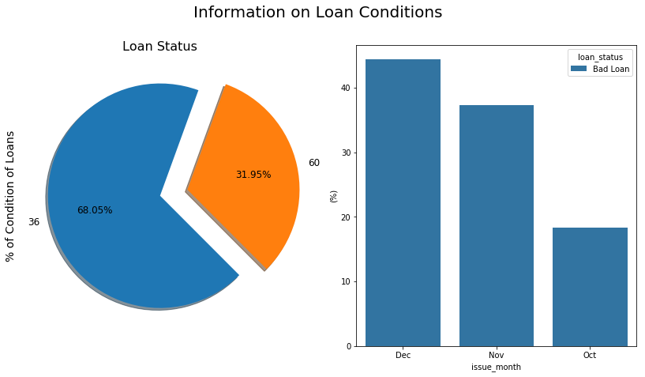

# Loan Status Prediction

## Introduction


In this project, I predictive modelling in order to understand how different set of features help to indentify
customer loan status. 


```python

```

## ETL Pipline

1. **Data Cleaning**:

    * Drop irrelevant features
    * Clean mixed type features
    * ....

2. **Exploratory Analysis**


3. **Machine Learning** 


```python

```

### Import Libraries


```python
import numpy as np
import pandas as pd
import seaborn as sns
from datetime import datetime
import matplotlib.pyplot as plt
%matplotlib inline  
import warnings
warnings.filterwarnings("ignore")
```

## Loan Data


```python
df_orig = pd.read_csv("data/loan.csv",low_memory=False,skiprows=1)
```


```python
df = df_orig
```


```python
df.info()
```

    <class 'pandas.core.frame.DataFrame'>
    RangeIndex: 99998 entries, 0 to 99997
    Columns: 145 entries, id to settlement_term
    dtypes: float64(67), int64(41), object(37)
    memory usage: 110.6+ MB


```python
df.head()
```


<div>
<style scoped>
    .dataframe tbody tr th:only-of-type {
        vertical-align: middle;
    }

    .dataframe tbody tr th {
        vertical-align: top;
    }

    .dataframe thead th {
        text-align: right;
    }
</style>
<table border="1" class="dataframe">
  <thead>
    <tr style="text-align: right;">
      <th></th>
      <th>id</th>
      <th>member_id</th>
      <th>loan_amnt</th>
      <th>funded_amnt</th>
      <th>funded_amnt_inv</th>
      <th>term</th>
      <th>int_rate</th>
      <th>installment</th>
      <th>grade</th>
      <th>sub_grade</th>
      <th>...</th>
      <th>hardship_payoff_balance_amount</th>
      <th>hardship_last_payment_amount</th>
      <th>disbursement_method</th>
      <th>debt_settlement_flag</th>
      <th>debt_settlement_flag_date</th>
      <th>settlement_status</th>
      <th>settlement_date</th>
      <th>settlement_amount</th>
      <th>settlement_percentage</th>
      <th>settlement_term</th>
    </tr>
  </thead>
  <tbody>
    <tr>
      <th>0</th>
      <td>NaN</td>
      <td>NaN</td>
      <td>24700</td>
      <td>24700</td>
      <td>24700</td>
      <td>36 months</td>
      <td>11.99%</td>
      <td>820.28</td>
      <td>C</td>
      <td>C1</td>
      <td>...</td>
      <td>NaN</td>
      <td>NaN</td>
      <td>Cash</td>
      <td>N</td>
      <td>NaN</td>
      <td>NaN</td>
      <td>NaN</td>
      <td>NaN</td>
      <td>NaN</td>
      <td>NaN</td>
    </tr>
    <tr>
      <th>1</th>
      <td>NaN</td>
      <td>NaN</td>
      <td>17925</td>
      <td>17925</td>
      <td>17925</td>
      <td>60 months</td>
      <td>17.27%</td>
      <td>448.09</td>
      <td>D</td>
      <td>D3</td>
      <td>...</td>
      <td>NaN</td>
      <td>NaN</td>
      <td>Cash</td>
      <td>N</td>
      <td>NaN</td>
      <td>NaN</td>
      <td>NaN</td>
      <td>NaN</td>
      <td>NaN</td>
      <td>NaN</td>
    </tr>
    <tr>
      <th>2</th>
      <td>NaN</td>
      <td>NaN</td>
      <td>9000</td>
      <td>9000</td>
      <td>9000</td>
      <td>36 months</td>
      <td>8.49%</td>
      <td>284.07</td>
      <td>B</td>
      <td>B1</td>
      <td>...</td>
      <td>NaN</td>
      <td>NaN</td>
      <td>Cash</td>
      <td>N</td>
      <td>NaN</td>
      <td>NaN</td>
      <td>NaN</td>
      <td>NaN</td>
      <td>NaN</td>
      <td>NaN</td>
    </tr>
    <tr>
      <th>3</th>
      <td>NaN</td>
      <td>NaN</td>
      <td>11550</td>
      <td>11550</td>
      <td>11550</td>
      <td>60 months</td>
      <td>16.59%</td>
      <td>284.51</td>
      <td>D</td>
      <td>D2</td>
      <td>...</td>
      <td>NaN</td>
      <td>NaN</td>
      <td>Cash</td>
      <td>N</td>
      <td>NaN</td>
      <td>NaN</td>
      <td>NaN</td>
      <td>NaN</td>
      <td>NaN</td>
      <td>NaN</td>
    </tr>
    <tr>
      <th>4</th>
      <td>NaN</td>
      <td>NaN</td>
      <td>12000</td>
      <td>12000</td>
      <td>12000</td>
      <td>60 months</td>
      <td>9.80%</td>
      <td>253.79</td>
      <td>B</td>
      <td>B3</td>
      <td>...</td>
      <td>NaN</td>
      <td>NaN</td>
      <td>Cash</td>
      <td>N</td>
      <td>NaN</td>
      <td>NaN</td>
      <td>NaN</td>
      <td>NaN</td>
      <td>NaN</td>
      <td>NaN</td>
    </tr>
  </tbody>
</table>
<p>5 rows × 145 columns</p>
</div>


```python
df.shape
```


    (99998, 145)


There are 145 features and most of them are irrelevant. So we keep most important features for further processing.


```python
keep_cols = ["loan_status","loan_amnt", "term","int_rate","installment","grade",
             "sub_grade", "emp_length","home_ownership","annual_inc",
             "verification_status","issue_d","dti","earliest_cr_line","open_acc",
             "revol_bal","revol_util","total_acc"]
df = df[keep_cols]
```


```python

```

### Fix Target Feature


```python
# simplify target feature
df.loan_status.unique()
```


    array(['Fully Paid', 'Current', 'Charged Off', 'Late (16-30 days)',
           'Late (31-120 days)', 'In Grace Period', 'Default'], dtype=object)


Target feature 'loan_status' has 7 factors. We will reduce it to two 'Good' and 'Bad' loans.


```python
good_loans = ['Fully Paid', 'Current']

def LoanCondition(status):
    if status in good_loans:
        return 'Good Loan'
    else:
        return 'Bad Loan'

tmp = df['loan_status'].apply(LoanCondition)
df.loan_status = tmp
```

### Clean Features

Some features have mixed type such as number mixed with string.

* Remove '%' from 'int_rate', 'revol_util' 
* Replace all 'n/a' with np.nan
* 


```python
def CleanData(df):
    """
    
    """
    
    #rm '%' and convert to float
    df.int_rate = pd.Series(df.int_rate).str.replace('%', '').astype(float)
    df.revol_util = pd.Series(df.revol_util).str.replace('%', '').astype(float)
    
    df.replace('n/a', np.nan,inplace = True)
    df.emp_length.fillna(value = 0,inplace = True)
    
    df['emp_length'].replace(to_replace = '[^0-9]+', value='', inplace = True, regex = True)
    df['emp_length'] = df['emp_length'].astype(int)
    
    issue_month = df.issue_d.str.replace('-2015', '')
    df['issue_month'] = pd.Series( issue_month, index=df.index)
    
    df.term = pd.Series(df.term).str.replace('months', '').astype(int)
    
    df.earliest_cr_line = pd.to_datetime(df.earliest_cr_line)
    df.issue_d = pd.to_datetime(df.issue_d)
    
    cred_age = df.issue_d - df.earliest_cr_line
    df['cred_age'] = pd.Series( cred_age, index=df.index)
        
    tmp = np.rint(df['cred_age'].map(lambda x: x.days/365))
    df['cred_age'] = pd.Series( tmp, index=df.index)

    df.drop(columns="issue_d",inplace=True)
    df.drop(columns="earliest_cr_line",inplace=True)
    
    return df

    
```


```python

```


```python
df = CleanData(df)
```


```python
#df['cred_age'] = pd.Series( tmp, index=df.index)    
```


```python

```


```python
#df_orig.purpose.value_counts()
```


```python

```


```python
df.sub_grade
```


```python
df.emp_length
```


```python
plt.figure(figsize=(14,7))
sns.barplot('emp_length', 'loan_amnt', data=df, palette='tab10')
```


    <matplotlib.axes._subplots.AxesSubplot at 0x7fb4eb2a4e10>


```python

```


```python
f, ax = plt.subplots(1,2, figsize=(14,7))

#colors = ["#3791D7", "#D72626"]

labels =['Fully Paid', 'Current', 'Charged Off', 'Late16-30days']

plt.suptitle('Information on Loan Conditions', fontsize=20)

df["term"].value_counts().plot.pie(explode=[0,0.25],
                                          autopct='%1.2f%%',
                                          ax=ax[0],
                                          shadow=True,
                                          #colors=colors,
                                          #labels=labels,
                                          fontsize=12,
                                          startangle=70)

ax[0].set_title('Loan Status', fontsize=16)
ax[0].set_ylabel('% of Condition of Loans', fontsize=14)


sns.barplot(x="issue_month", y="loan_amnt", hue="loan_status",
            data=df, #palette=palette,
            estimator=lambda x: len(x) / len(df) * 100)

ax[1].set(ylabel="(%)")
```


    [Text(0, 0.5, '(%)')]





```python
df.loan_status.unique()
```


    array(['Fully Paid', 'Current', 'Charged Off', 'Late (16-30 days)',
           'Late (31-120 days)', 'In Grace Period', 'Default'], dtype=object)


```python

```


```python
df[(df.loan_status == 'Current') | (df.loan_status == 'Fully Paid')].loan_status = "GoodLoan"
```


```python
df.head()
```


<div>
<style scoped>
    .dataframe tbody tr th:only-of-type {
        vertical-align: middle;
    }

    .dataframe tbody tr th {
        vertical-align: top;
    }

    .dataframe thead th {
        text-align: right;
    }
</style>
<table border="1" class="dataframe">
  <thead>
    <tr style="text-align: right;">
      <th></th>
      <th>loan_status</th>
      <th>loan_amnt</th>
      <th>term</th>
      <th>int_rate</th>
      <th>installment</th>
      <th>grade</th>
      <th>sub_grade</th>
      <th>emp_length</th>
      <th>home_ownership</th>
      <th>annual_inc</th>
      <th>verification_status</th>
      <th>dti</th>
      <th>open_acc</th>
      <th>revol_bal</th>
      <th>revol_util</th>
      <th>total_acc</th>
      <th>issue_month</th>
      <th>cred_age</th>
    </tr>
  </thead>
  <tbody>
    <tr>
      <th>0</th>
      <td>Fully Paid</td>
      <td>24700</td>
      <td>36</td>
      <td>11.99</td>
      <td>820.28</td>
      <td>C</td>
      <td>C1</td>
      <td>10</td>
      <td>MORTGAGE</td>
      <td>65000.0</td>
      <td>Not Verified</td>
      <td>16.06</td>
      <td>22</td>
      <td>21470</td>
      <td>19.2</td>
      <td>38</td>
      <td>Dec</td>
      <td>16.0</td>
    </tr>
    <tr>
      <th>1</th>
      <td>Current</td>
      <td>17925</td>
      <td>60</td>
      <td>17.27</td>
      <td>448.09</td>
      <td>D</td>
      <td>D3</td>
      <td>10</td>
      <td>OWN</td>
      <td>39000.0</td>
      <td>Source Verified</td>
      <td>27.78</td>
      <td>10</td>
      <td>19614</td>
      <td>76.0</td>
      <td>21</td>
      <td>Dec</td>
      <td>13.0</td>
    </tr>
    <tr>
      <th>2</th>
      <td>Fully Paid</td>
      <td>9000</td>
      <td>36</td>
      <td>8.49</td>
      <td>284.07</td>
      <td>B</td>
      <td>B1</td>
      <td>8</td>
      <td>MORTGAGE</td>
      <td>47000.0</td>
      <td>Not Verified</td>
      <td>8.43</td>
      <td>12</td>
      <td>9747</td>
      <td>26.7</td>
      <td>22</td>
      <td>Dec</td>
      <td>15.0</td>
    </tr>
    <tr>
      <th>3</th>
      <td>Charged Off</td>
      <td>11550</td>
      <td>60</td>
      <td>16.59</td>
      <td>284.51</td>
      <td>D</td>
      <td>D2</td>
      <td>5</td>
      <td>RENT</td>
      <td>38000.0</td>
      <td>Not Verified</td>
      <td>21.07</td>
      <td>9</td>
      <td>7179</td>
      <td>39.7</td>
      <td>12</td>
      <td>Dec</td>
      <td>5.0</td>
    </tr>
    <tr>
      <th>4</th>
      <td>Fully Paid</td>
      <td>12000</td>
      <td>60</td>
      <td>9.80</td>
      <td>253.79</td>
      <td>B</td>
      <td>B3</td>
      <td>10</td>
      <td>MORTGAGE</td>
      <td>65000.0</td>
      <td>Not Verified</td>
      <td>23.84</td>
      <td>18</td>
      <td>9786</td>
      <td>13.4</td>
      <td>37</td>
      <td>Dec</td>
      <td>12.0</td>
    </tr>
  </tbody>
</table>
</div>


```python

```


```python

```
