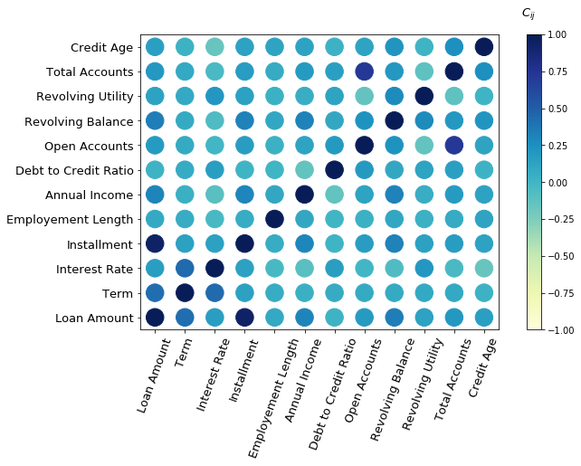
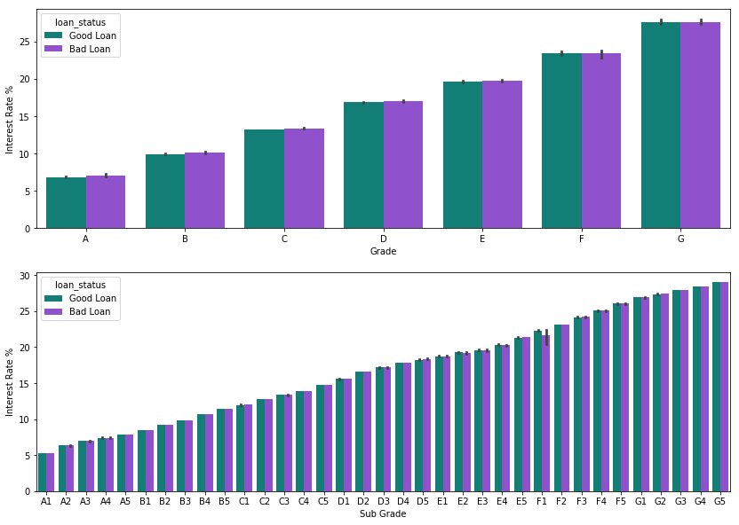

# Loan Status Prediction

## Introduction


In this project, I performe data analysis and predictive modelling on Lending Club's loan data set for the year 2015 in order to understand how different set of features help to indentify customer loan status. This can potentially  

## Lending Club Data

Lending Club is one of the America's largest lending companies that allows borrowers
to apply and obtain personal loans, auto refinancing, business loans, and elective medical procedures.
Additionally, they make some of their data publically available.  


```python

```

## ETL Pipline

1. **Data Cleaning**:

    * Drop irrelevant features
    * Clean mixed type features
    * ....

2. **Exploratory Analysis**


3. **Machine Learning** 
    * Feature Normalization
    * Train Test Split
    * Cross Validation
    * ML Prediction
    


### Import Libraries


```python
import numpy as np
import pandas as pd
import seaborn as sns
from datetime import datetime
import matplotlib.pyplot as plt

#plotly
from plotly.plotly import iplot
import plotly.graph_objs as go

from src.utility import *
from src.plotting import *
from src.ml_models import *

%matplotlib inline  
import warnings
warnings.filterwarnings("ignore")
```

## Loan Data


```python
keep_cols = ["loan_status","loan_amnt", "term","int_rate","installment","grade",
             "sub_grade","purpose","emp_length","home_ownership","annual_inc",
             "verification_status","issue_d","dti","earliest_cr_line","open_acc",
             "revol_bal","revol_util","total_acc"]

df_orig = pd.read_csv("data/loan.csv", usecols=keep_cols,skipfooter=1,skiprows=1)#,low_memory=False)
```


```python
df = df_orig
df.info()
```

    <class 'pandas.core.frame.DataFrame'>
    RangeIndex: 9997 entries, 0 to 9996
    Data columns (total 19 columns):
    loan_amnt              9997 non-null int64
    term                   9997 non-null object
    int_rate               9997 non-null object
    installment            9997 non-null float64
    grade                  9997 non-null object
    sub_grade              9997 non-null object
    emp_length             9448 non-null object
    home_ownership         9997 non-null object
    annual_inc             9997 non-null float64
    verification_status    9997 non-null object
    issue_d                9997 non-null object
    loan_status            9997 non-null object
    purpose                9997 non-null object
    dti                    9997 non-null float64
    earliest_cr_line       9997 non-null object
    open_acc               9997 non-null int64
    revol_bal              9997 non-null int64
    revol_util             9992 non-null object
    total_acc              9997 non-null int64
    dtypes: float64(3), int64(4), object(12)
    memory usage: 1.4+ MB


```python
df.head()
```


<div>
<style scoped>
    .dataframe tbody tr th:only-of-type {
        vertical-align: middle;
    }

    .dataframe tbody tr th {
        vertical-align: top;
    }

    .dataframe thead th {
        text-align: right;
    }
</style>
<table border="1" class="dataframe">
  <thead>
    <tr style="text-align: right;">
      <th></th>
      <th>loan_amnt</th>
      <th>term</th>
      <th>int_rate</th>
      <th>installment</th>
      <th>grade</th>
      <th>sub_grade</th>
      <th>emp_length</th>
      <th>home_ownership</th>
      <th>annual_inc</th>
      <th>verification_status</th>
      <th>issue_d</th>
      <th>loan_status</th>
      <th>purpose</th>
      <th>dti</th>
      <th>earliest_cr_line</th>
      <th>open_acc</th>
      <th>revol_bal</th>
      <th>revol_util</th>
      <th>total_acc</th>
    </tr>
  </thead>
  <tbody>
    <tr>
      <th>0</th>
      <td>24700</td>
      <td>36 months</td>
      <td>11.99%</td>
      <td>820.28</td>
      <td>C</td>
      <td>C1</td>
      <td>10+ years</td>
      <td>MORTGAGE</td>
      <td>65000.0</td>
      <td>Not Verified</td>
      <td>Dec-2015</td>
      <td>Fully Paid</td>
      <td>small_business</td>
      <td>16.06</td>
      <td>Dec-1999</td>
      <td>22</td>
      <td>21470</td>
      <td>19.2%</td>
      <td>38</td>
    </tr>
    <tr>
      <th>1</th>
      <td>17925</td>
      <td>60 months</td>
      <td>17.27%</td>
      <td>448.09</td>
      <td>D</td>
      <td>D3</td>
      <td>10+ years</td>
      <td>OWN</td>
      <td>39000.0</td>
      <td>Source Verified</td>
      <td>Dec-2015</td>
      <td>Current</td>
      <td>debt_consolidation</td>
      <td>27.78</td>
      <td>Sep-2002</td>
      <td>10</td>
      <td>19614</td>
      <td>76%</td>
      <td>21</td>
    </tr>
    <tr>
      <th>2</th>
      <td>9000</td>
      <td>36 months</td>
      <td>8.49%</td>
      <td>284.07</td>
      <td>B</td>
      <td>B1</td>
      <td>8 years</td>
      <td>MORTGAGE</td>
      <td>47000.0</td>
      <td>Not Verified</td>
      <td>Dec-2015</td>
      <td>Fully Paid</td>
      <td>debt_consolidation</td>
      <td>8.43</td>
      <td>Nov-2000</td>
      <td>12</td>
      <td>9747</td>
      <td>26.7%</td>
      <td>22</td>
    </tr>
    <tr>
      <th>3</th>
      <td>11550</td>
      <td>60 months</td>
      <td>16.59%</td>
      <td>284.51</td>
      <td>D</td>
      <td>D2</td>
      <td>5 years</td>
      <td>RENT</td>
      <td>38000.0</td>
      <td>Not Verified</td>
      <td>Dec-2015</td>
      <td>Charged Off</td>
      <td>credit_card</td>
      <td>21.07</td>
      <td>Jan-2011</td>
      <td>9</td>
      <td>7179</td>
      <td>39.7%</td>
      <td>12</td>
    </tr>
    <tr>
      <th>4</th>
      <td>12000</td>
      <td>60 months</td>
      <td>9.80%</td>
      <td>253.79</td>
      <td>B</td>
      <td>B3</td>
      <td>10+ years</td>
      <td>MORTGAGE</td>
      <td>65000.0</td>
      <td>Not Verified</td>
      <td>Dec-2015</td>
      <td>Fully Paid</td>
      <td>debt_consolidation</td>
      <td>23.84</td>
      <td>Nov-2003</td>
      <td>18</td>
      <td>9786</td>
      <td>13.4%</td>
      <td>37</td>
    </tr>
  </tbody>
</table>
</div>


There were overall 145 features and most of them were irrelevant. So we keep most important features for further processing that reduces memory usage and improves performance.

### Fix Target Feature


```python
# simplify target feature
df.loan_status.value_counts()
```


    Fully Paid            6958
    Charged Off           1672
    Current               1244
    Late (31-120 days)      86
    Late (16-30 days)       19
    In Grace Period         17
    Default                  1
    Name: loan_status, dtype: int64


Target feature 'loan_status' has 7 factors. We will reduce it to two 'Good' and 'Bad' loans.


```python
good_loans = ['Fully Paid', 'Current']

def LoanCondition(status):
    if status in good_loans:
        return 'Good Loan'
    else:
        return 'Bad Loan'
tmp = df['loan_status'].apply(LoanCondition)
df.loan_status = tmp
```


```python

```

### Clean Features

Some features have mixed type such as number mixed with string.

* Remove '%' from 'int_rate', 'revol_util' 
* Replace all 'n/a' with np.nan
* Extract numeric part of employment length
* Save name of the loan issued month
* Get credita agae from issue data and earliest credit line
* Again drop some unnecessary columns


```python
df = CleanData(df)
df.head()
```


<div>
<style scoped>
    .dataframe tbody tr th:only-of-type {
        vertical-align: middle;
    }

    .dataframe tbody tr th {
        vertical-align: top;
    }

    .dataframe thead th {
        text-align: right;
    }
</style>
<table border="1" class="dataframe">
  <thead>
    <tr style="text-align: right;">
      <th></th>
      <th>loan_amnt</th>
      <th>term</th>
      <th>int_rate</th>
      <th>installment</th>
      <th>grade</th>
      <th>sub_grade</th>
      <th>emp_length</th>
      <th>home_ownership</th>
      <th>annual_inc</th>
      <th>verification_status</th>
      <th>loan_status</th>
      <th>purpose</th>
      <th>dti</th>
      <th>open_acc</th>
      <th>revol_bal</th>
      <th>revol_util</th>
      <th>total_acc</th>
      <th>issue_month</th>
      <th>cred_age</th>
    </tr>
  </thead>
  <tbody>
    <tr>
      <th>0</th>
      <td>24700</td>
      <td>36</td>
      <td>11.99</td>
      <td>820.28</td>
      <td>C</td>
      <td>C1</td>
      <td>10</td>
      <td>MORTGAGE</td>
      <td>65000.0</td>
      <td>Not Verified</td>
      <td>Good Loan</td>
      <td>small_business</td>
      <td>16.06</td>
      <td>22</td>
      <td>21470</td>
      <td>19.2</td>
      <td>38</td>
      <td>Dec</td>
      <td>16.0</td>
    </tr>
    <tr>
      <th>1</th>
      <td>17925</td>
      <td>60</td>
      <td>17.27</td>
      <td>448.09</td>
      <td>D</td>
      <td>D3</td>
      <td>10</td>
      <td>OWN</td>
      <td>39000.0</td>
      <td>Source Verified</td>
      <td>Good Loan</td>
      <td>debt_consolidation</td>
      <td>27.78</td>
      <td>10</td>
      <td>19614</td>
      <td>76.0</td>
      <td>21</td>
      <td>Dec</td>
      <td>13.0</td>
    </tr>
    <tr>
      <th>2</th>
      <td>9000</td>
      <td>36</td>
      <td>8.49</td>
      <td>284.07</td>
      <td>B</td>
      <td>B1</td>
      <td>8</td>
      <td>MORTGAGE</td>
      <td>47000.0</td>
      <td>Not Verified</td>
      <td>Good Loan</td>
      <td>debt_consolidation</td>
      <td>8.43</td>
      <td>12</td>
      <td>9747</td>
      <td>26.7</td>
      <td>22</td>
      <td>Dec</td>
      <td>15.0</td>
    </tr>
    <tr>
      <th>3</th>
      <td>11550</td>
      <td>60</td>
      <td>16.59</td>
      <td>284.51</td>
      <td>D</td>
      <td>D2</td>
      <td>5</td>
      <td>RENT</td>
      <td>38000.0</td>
      <td>Not Verified</td>
      <td>Bad Loan</td>
      <td>credit_card</td>
      <td>21.07</td>
      <td>9</td>
      <td>7179</td>
      <td>39.7</td>
      <td>12</td>
      <td>Dec</td>
      <td>5.0</td>
    </tr>
    <tr>
      <th>4</th>
      <td>12000</td>
      <td>60</td>
      <td>9.80</td>
      <td>253.79</td>
      <td>B</td>
      <td>B3</td>
      <td>10</td>
      <td>MORTGAGE</td>
      <td>65000.0</td>
      <td>Not Verified</td>
      <td>Good Loan</td>
      <td>debt_consolidation</td>
      <td>23.84</td>
      <td>18</td>
      <td>9786</td>
      <td>13.4</td>
      <td>37</td>
      <td>Dec</td>
      <td>12.0</td>
    </tr>
  </tbody>
</table>
</div>


```python
#statistics of numeric features
df.describe().iloc[[1,2,3,7],:].round(1)
```


<div>
<style scoped>
    .dataframe tbody tr th:only-of-type {
        vertical-align: middle;
    }

    .dataframe tbody tr th {
        vertical-align: top;
    }

    .dataframe thead th {
        text-align: right;
    }
</style>
<table border="1" class="dataframe">
  <thead>
    <tr style="text-align: right;">
      <th></th>
      <th>loan_amnt</th>
      <th>term</th>
      <th>int_rate</th>
      <th>installment</th>
      <th>emp_length</th>
      <th>annual_inc</th>
      <th>dti</th>
      <th>open_acc</th>
      <th>revol_bal</th>
      <th>revol_util</th>
      <th>total_acc</th>
      <th>cred_age</th>
    </tr>
  </thead>
  <tbody>
    <tr>
      <th>mean</th>
      <td>15116.9</td>
      <td>43.1</td>
      <td>12.3</td>
      <td>441.5</td>
      <td>5.7</td>
      <td>78890.6</td>
      <td>19.5</td>
      <td>12.4</td>
      <td>17582.2</td>
      <td>51.0</td>
      <td>26.0</td>
      <td>16.8</td>
    </tr>
    <tr>
      <th>std</th>
      <td>8720.0</td>
      <td>10.9</td>
      <td>4.3</td>
      <td>251.0</td>
      <td>3.8</td>
      <td>64417.8</td>
      <td>13.1</td>
      <td>5.9</td>
      <td>22524.2</td>
      <td>24.2</td>
      <td>12.3</td>
      <td>7.6</td>
    </tr>
    <tr>
      <th>min</th>
      <td>1000.0</td>
      <td>36.0</td>
      <td>5.3</td>
      <td>30.5</td>
      <td>0.0</td>
      <td>1770.0</td>
      <td>0.0</td>
      <td>1.0</td>
      <td>0.0</td>
      <td>0.0</td>
      <td>4.0</td>
      <td>3.0</td>
    </tr>
    <tr>
      <th>max</th>
      <td>35000.0</td>
      <td>60.0</td>
      <td>29.0</td>
      <td>1354.7</td>
      <td>10.0</td>
      <td>3964280.0</td>
      <td>999.0</td>
      <td>55.0</td>
      <td>566420.0</td>
      <td>134.3</td>
      <td>105.0</td>
      <td>59.0</td>
    </tr>
  </tbody>
</table>
</div>


```python

```

### Loan Status & Amount


```python
plotLoanStat1(df,colors = ColorList([11,12]))
```


```python

```

* Based on fraction of 'Good' and 'Bad' loans, we don't have data imbalance problem.
* Percentage of issued loans seem to reduce as year ending!


```python

```


```python
df.purpose.value_counts()
```


    debt_consolidation    5723
    credit_card           2469
    home_improvement       562
    other                  552
    major_purchase         214
    medical                108
    car                    103
    small_business         102
    vacation                65
    moving                  52
    house                   43
    renewable_energy         4
    Name: purpose, dtype: int64


```python

```


```python
ave_good_loan_by_purpose = df[df.loan_status == 'Good Loan'].groupby('purpose').loan_amnt.mean().astype(int)
ave_bad_loan_by_purpose = df[df.loan_status == 'Bad Loan'].groupby('purpose').loan_amnt.mean().astype(int)

good_bars = go.Bar(
    x = list(ave_good_loan_by_purpose.index),
    y = list(ave_good_loan_by_purpose.values),
    name='Good Loans',
    text='%',
    marker=dict(
        color='rgba(50, 171, 96, 0.7)',
        line = dict(
            color='rgba(50, 171, 96, 1.0)',
            width=2
        )
    )
)


bad_bars = go.Bar(
    x = list(ave_bad_loan_by_purpose.index),
    y = list(ave_bad_loan_by_purpose.values),
    name = 'Bad Loans',
    text='%',
    marker=dict(
        color='rgba(219,64,82,0.7)',
        line = dict(
            color='rgba(219, 64, 82, 1.0)',
            width=2
        )
    )
)

data = [good_bars, bad_bars]

layout = go.Layout(
    title='Average Amount of Loan given for Different Purposes Classified by Loan Status',
    xaxis=dict(
        title=''
    ),
    yaxis=dict(
        title='Average Loan Amount',
    ),
    paper_bgcolor='rgba(250,200,200,0.3)',
    plot_bgcolor='rgba(250,200,200,0.3)',
    showlegend=True
)

fig = dict(data=data, layout=layout)
iplot(fig)

```


<iframe id="igraph" scrolling="no" style="border:none;" seamless="seamless" src="https://plot.ly/~truzmeto/47.embed" height="525px" width="100%"></iframe>


```python

```


```python

```

### Let's  look at how features are correlated


```python
cor = df.corr()
corr_names = ['Loan Amount', 'Term', 'Interest Rate', 'Installment', 'Employement Length',
              'Annual Income', 'Debt to Credit Ratio', 'Open Accounts', 'Revolving Balance',
              'Revolving Utility', 'Total Accounts','Credit Age']

cmap = "YlGnBu"
plt.figure(figsize=(9,6))
CPlot(corr_mat = cor.values, axis_labs = corr_names,cmap = cmap,
      pad = 0.05,rad = 380, xlab = '',ylab = '',fs = 13,
      xtick_lab_rot = 70)
```





'loan_amnt' and 'installment' are highly correlated

## Interest Rate

Sort 'grade' and 'sub_grade' in alphabetic order and check how interest rate varies across different grades.


```python
colors = ColorList([11,1])
plotLoanStats2(df,colors)
```





```python


```

sdfsdfffffffffffff


```python
plotLoanStat3(df)
```


### Bla Bla


```python

```


```python

```


```python
ave_good_loan_by_grade = df[df.loan_status == 'Good Loan'].groupby('grade',axis=0).loan_amnt.mean().astype(int)
ave_bad_loan_by_grade = df[df.loan_status == 'Bad Loan'].groupby('grade',axis=0).loan_amnt.mean().astype(int)

#prepare data for plotly
data = [
    go.Scatterpolar(mode='lines+markers',
        r = list(ave_good_loan_by_grade.values),
        theta = list(ave_good_loan_by_grade.index),
        fill = 'toself',
        name = 'Good Loans',
        line = dict(color = "#63AF63"),
        marker = dict(color = "#B3FFB3",symbol = "square",size = 11),
        subplot = "polar1"),

    go.Scatterpolar(
        mode='lines+markers',
        r = list(ave_bad_loan_by_grade.values),
        theta = list(ave_bad_loan_by_grade.index),
        fill = 'toself', name = 'Bad Loans',
        line = dict(color = "#C31414"),
        marker = dict(color = "#FF5050",symbol = "square",size = 11),
        subplot = "polar2")
]

#define layout
layout = go.Layout(
    title="Average Good and Bad Loans by Grade",
    showlegend = False,
    paper_bgcolor = "rgb(255, 248, 243)",
    polar1 = dict(
        domain = dict(
        x = [0,0.4],
        y = [0,1]
      ),
      radialaxis = dict(
        tickfont = dict(
          size = 12
        )
      ),
      angularaxis = dict(
        tickfont = dict(
          size = 12
        ),
        rotation = 90,
        direction = "counterclockwise"
      )
    ),
    polar2 = dict(
      domain = dict(
        x = [0.6,1],
        y = [0,1]
      ),
      radialaxis = dict(
        tickfont = dict(
          size = 12
        )
      ),
      angularaxis = dict(
        tickfont = dict(
          size = 12
        ),
        rotation = 90,
        direction = "clockwise"
      ),
    )
)

fig = go.Figure(data=data, layout=layout)
iplot(fig)
```


<iframe id="igraph" scrolling="no" style="border:none;" seamless="seamless" src="https://plot.ly/~truzmeto/25.embed" height="525px" width="100%"></iframe>


```python

```


```python

```


```python

```


```python

```
