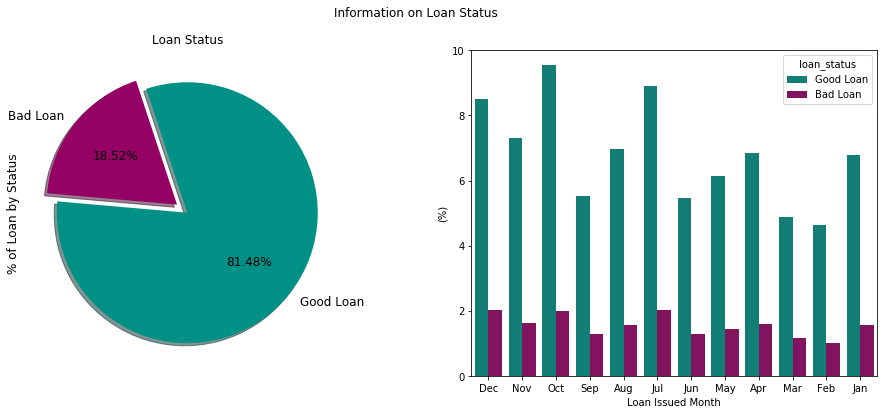
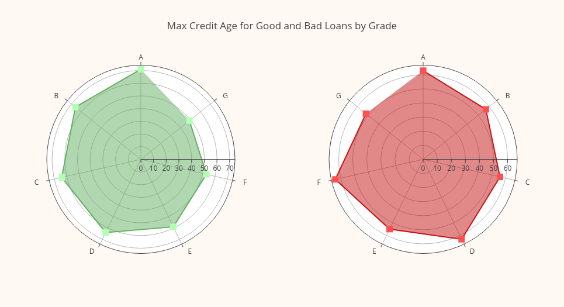

# Loan Status Prediction


## Introduction

It is crucial for lending companies or banks to make a correct desicion on issuing a loan to their customers. An optimal desicion considers both customer needs and companies interest that increases companies revenue. This optimization process done through risk assesment on individual customer by making comprison to loan/credit history of past or existing customers. In this project, I aim to demonstrate predictive modelling approach that can  potentially predict customer future status using lending clubs 2015 loan data set. 

## Lending Club Data

Lending Club is one of the America's largest lending companies that allows borrowers
to apply and obtain personal loans, auto refinancing, business loans, and elective medical procedures.
Additionally, they make some of their data publically available https://www.lendingclub.com/info/download-data.action.  


## ETL Pipline

1. **Data Cleaning**:

    * Drop irrelevant features
    * Clean mixed type features

2. **Exploratory Data Analysis**
    * Visualize different sets of features 
    * Another round of cleaning and featurer extraction
    

3. **Machine Learning** 
    * Feature Normalization
    * Train Test Split
    * ML Prediction
    


### Import Libraries


```python
import numpy as np
import pandas as pd
import seaborn as sns
from datetime import datetime
import matplotlib.pyplot as plt

#plotly
from plotly.plotly import iplot
import plotly.graph_objs as go

#my functions
#this functions relocated in order to make
#the report look less bulcky
from src.utility import CleanData, ColorList
from src.plotting import CPlot,plotLoanStat1, plotLoanStat2, plotLoanStat3
from src.ml_models import *

#import ml stuff
from sklearn import preprocessing
from sklearn.neural_network import MLPClassifier
from sklearn.model_selection import train_test_split
from sklearn.metrics import confusion_matrix,classification_report

#suppress warnings
import warnings
warnings.filterwarnings("ignore")
%matplotlib inline  
```

### Import Data

We import data by subsetting columns that are relevant and useful in data exploration. Raw data contains nearly 145 features. Some of these features are duplicates, some others are irrelevant( such as id,member_id,url etc.). By eliminating unnecessary features we reduce memory usage and speed up performance. 


```python
#extract data from lending club's website
#!curl https://resources.lendingclub.com/LoanStats3d.csv.zip > data/LoanStats3d.csv.zip
```


```python
keep_cols = ["loan_status","loan_amnt", "term","int_rate","installment","grade",
             "sub_grade","purpose","emp_length","home_ownership","annual_inc",
             "verification_status","issue_d","dti","earliest_cr_line","open_acc",
             "revol_bal","revol_util","total_acc"]
#"zip_code","addr_state"
df_orig = pd.read_csv("data/LoanStats3d.csv.zip", usecols=keep_cols,skipfooter=4,skiprows=1)#,low_memory=False)
```


```python
df = df_orig
df.info()
```

    <class 'pandas.core.frame.DataFrame'>
    RangeIndex: 421095 entries, 0 to 421094
    Data columns (total 19 columns):
    loan_amnt              421095 non-null int64
    term                   421095 non-null object
    int_rate               421095 non-null object
    installment            421095 non-null float64
    grade                  421095 non-null object
    sub_grade              421095 non-null object
    emp_length             397278 non-null object
    home_ownership         421095 non-null object
    annual_inc             421095 non-null float64
    verification_status    421095 non-null object
    issue_d                421095 non-null object
    loan_status            421095 non-null object
    purpose                421095 non-null object
    dti                    421093 non-null float64
    earliest_cr_line       421095 non-null object
    open_acc               421095 non-null int64
    revol_bal              421095 non-null int64
    revol_util             420933 non-null object
    total_acc              421095 non-null int64
    dtypes: float64(3), int64(4), object(12)
    memory usage: 61.0+ MB


Only 19 features are choosen to process further. Feature names are self explanatory. Data info show some numeric or integer data types and some categorical data types(object). Let's take a closer look at a few rows.


```python
df.head()
```


<div>
<style scoped>
    .dataframe tbody tr th:only-of-type {
        vertical-align: middle;
    }

    .dataframe tbody tr th {
        vertical-align: top;
    }

    .dataframe thead th {
        text-align: right;
    }
</style>
<table border="1" class="dataframe">
  <thead>
    <tr style="text-align: right;">
      <th></th>
      <th>loan_amnt</th>
      <th>term</th>
      <th>int_rate</th>
      <th>installment</th>
      <th>grade</th>
      <th>sub_grade</th>
      <th>emp_length</th>
      <th>home_ownership</th>
      <th>annual_inc</th>
      <th>verification_status</th>
      <th>issue_d</th>
      <th>loan_status</th>
      <th>purpose</th>
      <th>dti</th>
      <th>earliest_cr_line</th>
      <th>open_acc</th>
      <th>revol_bal</th>
      <th>revol_util</th>
      <th>total_acc</th>
    </tr>
  </thead>
  <tbody>
    <tr>
      <th>0</th>
      <td>24700</td>
      <td>36 months</td>
      <td>11.99%</td>
      <td>820.28</td>
      <td>C</td>
      <td>C1</td>
      <td>10+ years</td>
      <td>MORTGAGE</td>
      <td>65000.0</td>
      <td>Not Verified</td>
      <td>Dec-2015</td>
      <td>Fully Paid</td>
      <td>small_business</td>
      <td>16.06</td>
      <td>Dec-1999</td>
      <td>22</td>
      <td>21470</td>
      <td>19.2%</td>
      <td>38</td>
    </tr>
    <tr>
      <th>1</th>
      <td>17925</td>
      <td>60 months</td>
      <td>17.27%</td>
      <td>448.09</td>
      <td>D</td>
      <td>D3</td>
      <td>10+ years</td>
      <td>OWN</td>
      <td>39000.0</td>
      <td>Source Verified</td>
      <td>Dec-2015</td>
      <td>Current</td>
      <td>debt_consolidation</td>
      <td>27.78</td>
      <td>Sep-2002</td>
      <td>10</td>
      <td>19614</td>
      <td>76%</td>
      <td>21</td>
    </tr>
    <tr>
      <th>2</th>
      <td>9000</td>
      <td>36 months</td>
      <td>8.49%</td>
      <td>284.07</td>
      <td>B</td>
      <td>B1</td>
      <td>8 years</td>
      <td>MORTGAGE</td>
      <td>47000.0</td>
      <td>Not Verified</td>
      <td>Dec-2015</td>
      <td>Fully Paid</td>
      <td>debt_consolidation</td>
      <td>8.43</td>
      <td>Nov-2000</td>
      <td>12</td>
      <td>9747</td>
      <td>26.7%</td>
      <td>22</td>
    </tr>
    <tr>
      <th>3</th>
      <td>11550</td>
      <td>60 months</td>
      <td>16.59%</td>
      <td>284.51</td>
      <td>D</td>
      <td>D2</td>
      <td>5 years</td>
      <td>RENT</td>
      <td>38000.0</td>
      <td>Not Verified</td>
      <td>Dec-2015</td>
      <td>Charged Off</td>
      <td>credit_card</td>
      <td>21.07</td>
      <td>Jan-2011</td>
      <td>9</td>
      <td>7179</td>
      <td>39.7%</td>
      <td>12</td>
    </tr>
    <tr>
      <th>4</th>
      <td>12000</td>
      <td>60 months</td>
      <td>9.80%</td>
      <td>253.79</td>
      <td>B</td>
      <td>B3</td>
      <td>10+ years</td>
      <td>MORTGAGE</td>
      <td>65000.0</td>
      <td>Not Verified</td>
      <td>Dec-2015</td>
      <td>Fully Paid</td>
      <td>debt_consolidation</td>
      <td>23.84</td>
      <td>Nov-2003</td>
      <td>18</td>
      <td>9786</td>
      <td>13.4%</td>
      <td>37</td>
    </tr>
  </tbody>
</table>
</div>


As shown, some features have mixed data type such as number mixed with string that needs cleaning. In addition,
date_time features can be used to extract a new more meaningfull feature. For instance, by subtracting 'earliest credit line' from 'issue date' we obtain 'credit age' that might have more impact on prediction.

* Remove '%' from 'int_rate', 'revol_util' 
* Replace all 'n/a' with np.nan
* Extract numeric part of employment length
* Save name of the loan issued month
* Get credita agae from issue data and earliest credit line
* Again drop some unnecessary columns

###  Feature Cleaning

Here, I call a function that performs data cleaning that is located in 'src/utility.py' file. 


```python
df = CleanData(df)
df.head()
```


<div>
<style scoped>
    .dataframe tbody tr th:only-of-type {
        vertical-align: middle;
    }

    .dataframe tbody tr th {
        vertical-align: top;
    }

    .dataframe thead th {
        text-align: right;
    }
</style>
<table border="1" class="dataframe">
  <thead>
    <tr style="text-align: right;">
      <th></th>
      <th>loan_amnt</th>
      <th>term</th>
      <th>int_rate</th>
      <th>installment</th>
      <th>grade</th>
      <th>sub_grade</th>
      <th>emp_length</th>
      <th>home_ownership</th>
      <th>annual_inc</th>
      <th>verification_status</th>
      <th>loan_status</th>
      <th>purpose</th>
      <th>dti</th>
      <th>open_acc</th>
      <th>revol_bal</th>
      <th>revol_util</th>
      <th>total_acc</th>
      <th>issue_month</th>
      <th>cred_age</th>
    </tr>
  </thead>
  <tbody>
    <tr>
      <th>0</th>
      <td>24700</td>
      <td>36 months</td>
      <td>11.99</td>
      <td>820.28</td>
      <td>C</td>
      <td>C1</td>
      <td>10</td>
      <td>MORTGAGE</td>
      <td>65000.0</td>
      <td>Not Verified</td>
      <td>Fully Paid</td>
      <td>small_business</td>
      <td>16.06</td>
      <td>22</td>
      <td>21470</td>
      <td>19.2</td>
      <td>38</td>
      <td>Dec</td>
      <td>16.0</td>
    </tr>
    <tr>
      <th>1</th>
      <td>17925</td>
      <td>60 months</td>
      <td>17.27</td>
      <td>448.09</td>
      <td>D</td>
      <td>D3</td>
      <td>10</td>
      <td>OWN</td>
      <td>39000.0</td>
      <td>Source Verified</td>
      <td>Current</td>
      <td>debt_consolidation</td>
      <td>27.78</td>
      <td>10</td>
      <td>19614</td>
      <td>76.0</td>
      <td>21</td>
      <td>Dec</td>
      <td>13.0</td>
    </tr>
    <tr>
      <th>2</th>
      <td>9000</td>
      <td>36 months</td>
      <td>8.49</td>
      <td>284.07</td>
      <td>B</td>
      <td>B1</td>
      <td>8</td>
      <td>MORTGAGE</td>
      <td>47000.0</td>
      <td>Not Verified</td>
      <td>Fully Paid</td>
      <td>debt_consolidation</td>
      <td>8.43</td>
      <td>12</td>
      <td>9747</td>
      <td>26.7</td>
      <td>22</td>
      <td>Dec</td>
      <td>15.0</td>
    </tr>
    <tr>
      <th>3</th>
      <td>11550</td>
      <td>60 months</td>
      <td>16.59</td>
      <td>284.51</td>
      <td>D</td>
      <td>D2</td>
      <td>5</td>
      <td>RENT</td>
      <td>38000.0</td>
      <td>Not Verified</td>
      <td>Charged Off</td>
      <td>credit_card</td>
      <td>21.07</td>
      <td>9</td>
      <td>7179</td>
      <td>39.7</td>
      <td>12</td>
      <td>Dec</td>
      <td>5.0</td>
    </tr>
    <tr>
      <th>4</th>
      <td>12000</td>
      <td>60 months</td>
      <td>9.80</td>
      <td>253.79</td>
      <td>B</td>
      <td>B3</td>
      <td>10</td>
      <td>MORTGAGE</td>
      <td>65000.0</td>
      <td>Not Verified</td>
      <td>Fully Paid</td>
      <td>debt_consolidation</td>
      <td>23.84</td>
      <td>18</td>
      <td>9786</td>
      <td>13.4</td>
      <td>37</td>
      <td>Dec</td>
      <td>12.0</td>
    </tr>
  </tbody>
</table>
</div>


Cleaning function did the job by extracting numeric part from mixed data types. Also, we have a new feature that is 'credit age' measured in years. Next we point attantion to a target feature.

### The Target Feature : Loan Status


```python
# simplify target feature
df.loan_status.value_counts()
```


    Fully Paid            296634
    Charged Off            74762
    Current                46461
    Late (31-120 days)      1819
    In Grace Period          980
    Late (16-30 days)        434
    Default                    5
    Name: loan_status, dtype: int64


Target feature 'loan_status' is composed of 7 factors. For simplicity, we reduce it down to two 'Good' and 'Bad' loans. We consider 'Fully Paid' and 'Current' as good loans, while the rest as bad loans. Here, I make a new function to achieve above transformation.


```python
good_loans = ['Fully Paid', 'Current']

def ChangeStatus(status):
    if status in good_loans:
        return 'Good Loan'
    else:
        return 'Bad Loan'
tmp = df['loan_status'].apply(ChangeStatus)
df.loan_status = tmp
```


```python
df.loan_status.value_counts()
```


    Good Loan    343095
    Bad Loan      78000
    Name: loan_status, dtype: int64


```python
print('Good Loans Fraction =',round(df.loan_status.value_counts()[0]/df.shape[0],2))
print('Bad Loans Fraction =',round(df.loan_status.value_counts()[1]/df.shape[0],2))
```

    Good Loans Fraction = 0.81
    Bad Loans Fraction = 0.19


```python
plotLoanStat1(df,colors = ColorList([11,12]))
```





* Based on fraction of 'Good' and 'Bad' loans, we do have data imbalance problem that must be addressed before applying predictive modelling.
* Percentage of issued loans seem to increase slightly as time passes. Percentage of Good Loans granted every month is nearly 4 times more than Bad Loans.

### Feature Statistics

It is always important to check for extreme cases. For instance, checking min and max values of features might help spot outliers. Pandas have a convinient function 'describe' to fullfill this task.


```python
#statistics of numeric features
df.describe().iloc[[1,2,3,7],:].round(1)
```


<div>
<style scoped>
    .dataframe tbody tr th:only-of-type {
        vertical-align: middle;
    }

    .dataframe tbody tr th {
        vertical-align: top;
    }

    .dataframe thead th {
        text-align: right;
    }
</style>
<table border="1" class="dataframe">
  <thead>
    <tr style="text-align: right;">
      <th></th>
      <th>loan_amnt</th>
      <th>int_rate</th>
      <th>installment</th>
      <th>emp_length</th>
      <th>annual_inc</th>
      <th>dti</th>
      <th>open_acc</th>
      <th>revol_bal</th>
      <th>revol_util</th>
      <th>total_acc</th>
      <th>cred_age</th>
    </tr>
  </thead>
  <tbody>
    <tr>
      <th>mean</th>
      <td>15240.3</td>
      <td>12.6</td>
      <td>441.8</td>
      <td>5.8</td>
      <td>76965.6</td>
      <td>19.1</td>
      <td>11.9</td>
      <td>17685.5</td>
      <td>53.8</td>
      <td>25.5</td>
      <td>16.8</td>
    </tr>
    <tr>
      <th>std</th>
      <td>8571.3</td>
      <td>4.3</td>
      <td>244.8</td>
      <td>3.8</td>
      <td>73950.0</td>
      <td>8.9</td>
      <td>5.6</td>
      <td>24195.0</td>
      <td>23.9</td>
      <td>12.1</td>
      <td>7.6</td>
    </tr>
    <tr>
      <th>min</th>
      <td>1000.0</td>
      <td>5.3</td>
      <td>14.0</td>
      <td>0.0</td>
      <td>0.0</td>
      <td>0.0</td>
      <td>1.0</td>
      <td>0.0</td>
      <td>0.0</td>
      <td>4.0</td>
      <td>3.0</td>
    </tr>
    <tr>
      <th>max</th>
      <td>35000.0</td>
      <td>29.0</td>
      <td>1445.5</td>
      <td>10.0</td>
      <td>9500000.0</td>
      <td>999.0</td>
      <td>90.0</td>
      <td>2904836.0</td>
      <td>193.0</td>
      <td>169.0</td>
      <td>71.0</td>
    </tr>
  </tbody>
</table>
</div>


* Max loan amount is 35K, while min loan amount is as low as 1000 dollars. 
* Credit term is either 36 or 60 month, so it is better to keep it as categorical feature.
* Interest rate range seems reasonable (5% - 29%), installments and employement length look fine 
* Max annual income looks too high, let's take closer look!


```python
df[df.annual_inc == 9500000]
```


<div>
<style scoped>
    .dataframe tbody tr th:only-of-type {
        vertical-align: middle;
    }

    .dataframe tbody tr th {
        vertical-align: top;
    }

    .dataframe thead th {
        text-align: right;
    }
</style>
<table border="1" class="dataframe">
  <thead>
    <tr style="text-align: right;">
      <th></th>
      <th>loan_amnt</th>
      <th>term</th>
      <th>int_rate</th>
      <th>installment</th>
      <th>grade</th>
      <th>sub_grade</th>
      <th>emp_length</th>
      <th>home_ownership</th>
      <th>annual_inc</th>
      <th>verification_status</th>
      <th>loan_status</th>
      <th>purpose</th>
      <th>dti</th>
      <th>open_acc</th>
      <th>revol_bal</th>
      <th>revol_util</th>
      <th>total_acc</th>
      <th>issue_month</th>
      <th>cred_age</th>
    </tr>
  </thead>
  <tbody>
    <tr>
      <th>231029</th>
      <td>24000</td>
      <td>60 months</td>
      <td>7.89</td>
      <td>485.38</td>
      <td>A</td>
      <td>A5</td>
      <td>10</td>
      <td>MORTGAGE</td>
      <td>9500000.0</td>
      <td>Source Verified</td>
      <td>Bad Loan</td>
      <td>credit_card</td>
      <td>0.12</td>
      <td>12</td>
      <td>16854</td>
      <td>22.0</td>
      <td>31</td>
      <td>Jul</td>
      <td>33.0</td>
    </tr>
  </tbody>
</table>
</div>


This is indeed interesting case, where customer's loan status was marked as bad with almost 1000K annual income, excellent credit history, and he wanted 24K for 60 month term. Probably, he forgot to make payment on time. This is way higher than national average, and can be considered an outlier.  


```python
#drop_indx = df[df.annual_inc == 9500000].index[0]
#df.drop(drop_indx, inplace=True) # keep it
```

### Loan Purpose


```python
df.purpose.value_counts()
```


    debt_consolidation    250020
    credit_card           102025
    home_improvement       25293
    other                  19204
    major_purchase          7449
    medical                 3938
    car                     3466
    small_business          3364
    moving                  2420
    vacation                2249
    house                   1438
    renewable_energy         224
    wedding                    4
    educational                1
    Name: purpose, dtype: int64


Loan is given for variety of different purposes as listed above. Most common cases are debt consolidation, credit card, and home improvement. Now, let's take a look at how amount of loan varies among different loan purposes by loan status using beautiful figure tailored with 'plotly'.


```python
ave_good_loan_by_purpose = df[df.loan_status == 'Good Loan'].groupby('purpose').loan_amnt.mean().astype(int)
ave_bad_loan_by_purpose = df[df.loan_status == 'Bad Loan'].groupby('purpose').loan_amnt.mean().astype(int)

good_bars = go.Bar(
    x = list(ave_good_loan_by_purpose.index),
    y = list(ave_good_loan_by_purpose.values),
    name='Good Loans',
    text='%',
    marker=dict(
        color='rgba(50, 171, 96, 0.7)',
        line = dict(
            color='rgba(50, 171, 96, 1.0)',
            width=2
        )
    )
)

bad_bars = go.Bar(
    x = list(ave_bad_loan_by_purpose.index),
    y = list(ave_bad_loan_by_purpose.values),
    name = 'Bad Loans',
    text='%',
    marker=dict(
        color='rgba(219,64,82,0.7)',
        line = dict(
            color='rgba(219, 64, 82, 1.0)',
            width=2
        )
    )
)

data = [good_bars, bad_bars]

layout = go.Layout(
    title='Average Amount of Loan given for Different Purposes Classified by Loan Status',
    xaxis=dict(
        title=''
    ),
    yaxis=dict(
        title='Average Loan Amount',
    ),
    paper_bgcolor='rgba(250,200,200,0.3)',
    plot_bgcolor='rgba(250,200,200,0.3)',
    showlegend=True
)

fig = dict(data=data, layout=layout)
iplot(fig)

```


<iframe id="igraph" scrolling="no" style="border:none;" seamless="seamless" src="https://plot.ly/~truzmeto/101.embed" height="525px" width="100%"></iframe>


Plotly images may not be visible in a github repo. Thus, I also attached locally saved static image.

**Load Static Image**


For most of the loan purposes, red bars are slightly taller than the green. Only money lended for educational or wedding purposes stayed completely clean, meaning no missed payments, no charged offs etc. This suggests that 'loan purpose' feature may be a good candidate for our binary classification problem since it is able to catch some difference between good and bad loans. 

### Feature Correlations

Correlations between features helps to solve collinearity problem. Highly correlated features tend to
negativaly affect the prediction performance by introducing bias towards that specific feature. Thus, in practice, among highy correlated features we keep one, and remove the rest. Here, I use function built on top of matplotlib
('src/plotting.py') to illustrate feature correlation.


```python
cor = df.corr()
corr_names = ['Loan Amount', 'Interest Rate', 'Installment', 'Employement Length',
              'Annual Income', 'Debt to Credit Ratio', 'Open Accounts', 'Revolving Balance',
              'Revolving Utility', 'Total Accounts','Credit Age']

cmap = "YlGnBu"
plt.figure(figsize=(9,7))
CPlot(corr_mat = cor.values, axis_labs = corr_names,cmap = cmap,
      pad = 0.05,rad = 41*len(cor), xlab = '',ylab = '',fs = 13,
      xtick_lab_rot = 70)
```


'loan_amnt' and 'installment' are highly correlated. Therefore, we can drop the 'installments'.


```python
df.drop(columns="installment",inplace = True)
```

## Interest Rate

Interest rate is another interesting aspect of loan to look at. Here, I sort 'grade' and 'sub_grade'
in alphabetic order and check how interest rate varies across different grades. 


```python
colors = ColorList([11,1])
plotLoanStat2(df,colors)
```


* Interest rates show a good correlation with loan grade. More interest applied as grade goes down from A to G
* In some cases, loan status marked as 'bad' show slightly higher inerest rate, but negligable. 
* Again, this feature may not be a good predictor of loan status!


Next, we consider variation of interest rate in time across different home ownership types by calling 'plotLoanStat3' function. (src/plotting.py)


```python
plotLoanStat3(df)
```


* Home ownership type "ANY" did not show up
* Home renters seem to pay more interest on loans compared to other cases


```python
df.home_ownership.value_counts()
```


    MORTGAGE    207683
    RENT        167644
    OWN          45766
    ANY              2
    Name: home_ownership, dtype: int64


There are only 2 cases for "ANY", that we will replace with "OWN" to reduce memory usage later for dummy encoding.


```python
 df['home_ownership'] = df['home_ownership'].replace(['ANY'], 'OWN')
```


```python
df.home_ownership.value_counts()
```


    MORTGAGE    207683
    RENT        167644
    OWN          45768
    Name: home_ownership, dtype: int64


### Loan Amount by Income Class

First, I make a function in order to partition income into different classes.


```python
def partition_income(income):
    #np.empty(len(income))
    clas = []
    for val in range(len(income)):
        if val <= 20000:
            clas.append("lowB")
        elif (val > 20000) and (val <= 35000):
            clas.append("lowA")
        elif (val > 35000) and (val <= 50000):
            clas.append("midB")
        elif (val > 50000) and (val <= 70000):
            clas.append("midA")
        elif (val > 70000) and (val <= 100000):
            clas.append("upperB")
        elif (val > 100000) and (val <= 250000):
            clas.append("upperA")
        else:            
            clas.append("Rich")
            
    return clas
        
```


```python
classes = partition_income(df.annual_inc.values)
```

Then, I add this new feature into our data frame.


```python
df['inc_class'] = pd.Series( classes, index=df.index)     
```


```python
df.inc_class.value_counts()
```


    Rich      171094
    upperA    150000
    upperB     30000
    lowB       20001
    midA       20000
    lowA       15000
    midB       15000
    Name: inc_class, dtype: int64


Wow! This data set seem to contain mostly rich people based on their over 250K annual income.
Let's visualize it!


```python
fig, ax = plt.subplots(1,2, figsize=(14,5))

loan_rich = df[df.inc_class == 'Rich'].loan_amnt.values
loan_lowB = df[df.inc_class == 'lowB'].loan_amnt.values

sns.distplot(loan_rich, ax=ax[0], color="#F7522F")
ax[0].set_title("Distribution of loan given to Rich", fontsize=14)

sns.distplot(loan_lowB, ax=ax[1], color="#2F8FF7")
ax[1].set_title("Distribution of loan given to lowB class", fontsize=14)

```


    Text(0.5, 1.0, 'Distribution of loan given to lowB class')


```python
ave_good_loan_by_class = df[df.loan_status == 'Good Loan'].groupby('inc_class',axis=0).loan_amnt.sum().astype(int)
ave_bad_loan_by_class = df[df.loan_status == 'Bad Loan'].groupby('inc_class',axis=0).loan_amnt.sum().astype(int)

#prepare data for plotly
data = [
    go.Scatterpolar(mode='lines+markers',
        r = list(ave_good_loan_by_class.values),
        theta = list(ave_good_loan_by_class.index),
        fill = 'toself',
        name = 'Good Loans',
        line = dict(color = "#63AF63"),
        marker = dict(color = "#B3FFB3",symbol = "square",size = 11),
        subplot = "polar1"),

    go.Scatterpolar(
        mode='lines+markers',
        r = list(ave_bad_loan_by_class.values),
        theta = list(ave_bad_loan_by_class.index),
        fill = 'toself', name = 'Bad Loans',
        line = dict(color = "#C31414"),
        marker = dict(color = "#FF5050",symbol = "square",size = 11),
        subplot = "polar2")
]

#define layout
layout = go.Layout(
    title="Total Good and Bad Loans by Income Class",
    showlegend = False,
    paper_bgcolor = "rgb(255, 248, 243)",
    polar1 = dict(
        domain = dict(
        x = [0,0.4],
        y = [0,1]
      ),
      radialaxis = dict(
        tickfont = dict(
          size = 12
        )
      ),
      angularaxis = dict(
        tickfont = dict(
          size = 12
        ),
        rotation = 90,
        direction = "counterclockwise"
      )
    ),
    polar2 = dict(
      domain = dict(
        x = [0.6,1],
        y = [0,1]
      ),
      radialaxis = dict(
        tickfont = dict(
          size = 12
        )
      ),
      angularaxis = dict(
        tickfont = dict(
          size = 12
        ),
        rotation = 90,
        direction = "clockwise"
      ),
    )
)

fig = go.Figure(data=data, layout=layout)
iplot(fig)
```


<iframe id="igraph" scrolling="no" style="border:none;" seamless="seamless" src="https://plot.ly/~truzmeto/103.embed" height="525px" width="100%"></iframe>


**Loading static Image**


* Looks like most of the net loan money is consumed by 'Rich' and 'UpperA' class, not surprisingly amout given to other classes is marginal.
* Total loan amout given to upperA and rich class approximates 2 billion for good loans, while it is close to 500 million for bad loans. 


```python

```


```python
ave_good_loan_by_grade = df[df.loan_status == 'Good Loan'].groupby('grade',axis=0).cred_age.max().astype(int)
ave_bad_loan_by_grade = df[df.loan_status == 'Bad Loan'].groupby('grade',axis=0).cred_age.max().astype(int)

#prepare data for plotly
data = [
    go.Scatterpolar(mode='lines+markers',
        r = list(ave_good_loan_by_grade.values),
        theta = list(ave_good_loan_by_grade.index),
        fill = 'toself',
        name = 'Good Loans',
        line = dict(color = "#63AF63"),
        marker = dict(color = "#B3FFB3",symbol = "square",size = 11),
        subplot = "polar1"),

    go.Scatterpolar(
        mode='lines+markers',
        r = list(ave_bad_loan_by_grade.values),
        theta = list(ave_bad_loan_by_grade.index),
        fill = 'toself', name = 'Bad Loans',
        line = dict(color = "#C31414"),
        marker = dict(color = "#FF5050",symbol = "square",size = 11),
        subplot = "polar2")
]

#define layout
layout = go.Layout(
    title="Max Credit Age for Good and Bad Loans by Grade",
    showlegend = False,
    paper_bgcolor = "rgb(255, 248, 243)",
    polar1 = dict(
        domain = dict(
        x = [0,0.4],
        y = [0,1]
      ),
      radialaxis = dict(
        tickfont = dict(
          size = 12
        )
      ),
      angularaxis = dict(
        tickfont = dict(
          size = 12
        ),
        rotation = 90,
        direction = "counterclockwise"
      )
    ),
    polar2 = dict(
      domain = dict(
        x = [0.6,1],
        y = [0,1]
      ),
      radialaxis = dict(
        tickfont = dict(
          size = 12
        )
      ),
      angularaxis = dict(
        tickfont = dict(
          size = 12
        ),
        rotation = 90,
        direction = "clockwise"
      ),
    )
)

fig = go.Figure(data=data, layout=layout)
iplot(fig)
```


<iframe id="igraph" scrolling="no" style="border:none;" seamless="seamless" src="https://plot.ly/~truzmeto/105.embed" height="525px" width="100%"></iframe>


**Loading static Image**



This finalizes or data analysis. Now, we shift the attention to Machine Learning.

## Machine Learning

Here, using cleaned data we apply predictive modelling to identify if customer loan status is going to be
good or bad. First we apply min max normalization to numeric features. Then, to avoid issues due to data imbalance
we increase population of under represented class by simply replicating it. Then, we performe one-hot-encoding on all categorical features. Finally, we split entire data set into 70% training and 30% testing sub sets and data is ready for ML.

### Feature Normalization


```python
#drop issue_month
df.drop(columns="issue_month",inplace = True)
```


```python
#split numeric from categorical features
df_cat = df[['term','grade','sub_grade','home_ownership',
             'verification_status', 'loan_status','purpose', 'inc_class']]

df_num = df[['loan_amnt', 'int_rate', 'emp_length','annual_inc','dti', 'open_acc',
           'revol_bal', 'revol_util', 'total_acc','cred_age']]

# min max normalize numeric features
Min_Max_Scaler = preprocessing.MinMaxScaler()
df_norm = pd.DataFrame(Min_Max_Scaler.fit_transform(df_num.values))

#retrive colnames of normed df
df_norm.columns = list(df_num.columns)

#join normed feateres with categorical features
df = pd.concat([df_cat, df_norm], axis=1)

#join normed feateres with categorical features
df = pd.concat([df_cat, df_norm], axis=1)

df.fillna(0.0,inplace=True)
df.fillna(0,inplace=True)

```

### Simple trick to avoid data imbalance

Here, I triple the amount of underrepresented class and shuffle. This makes sure that random forest classifier
samples equal amouts of data from both classes, when it performs bagging. 


```python
from sklearn.utils import shuffle
df_bad = df[df.loan_status == 'Bad Loan']
df = pd.concat([df,df_bad])
df = shuffle(df)
df = pd.concat([df,df_bad])
df = shuffle(df)
```

### Split target label from data & performe dummy encoding


```python
#split target labels from data
labels = df['loan_status']#.values
data = df.drop('loan_status',axis=1)#.values

#performe one-hot-encoding on categorical features
data = pd.get_dummies(data)
```


```python
data.shape
```


    (577095, 81)


One-hot-encoding blew up number of features from 18 to 81!

### Train Test Split & Apply Random Fores Classification

Random Forest is basically a decision tree method with bagging(bootstrap aggregating).
Bagging is a resampling technique, where subset of data is drown from original data with
replacement many many times. By training a model(tree) on each resampled equal size
subset we get a lot of distinct models that can be built into stronger learner when combined.
In a Random Forest algorithm, we grow a tree on each resampled N subsets of data and later
aggregate finale fit of all those trees. Averaging multiple models have similar bias as
each of the models on its own, and reduced variance because of the average taken. 
Here I used scikitlearn's Random Forest classifier 'RandomForestClassifier'.


```python
#train test split
x_train, x_test, y_train, y_test = train_test_split(data, labels, test_size=0.30, random_state=10)
```


```python
from sklearn.ensemble import RandomForestClassifier
rf = RandomForestClassifier(n_estimators=500,
                            max_depth=2,
                            random_state=10,
                            n_jobs=-1)

rf.fit(x_train, y_train)
```


    RandomForestClassifier(bootstrap=True, class_weight=None, criterion='gini',
                max_depth=2, max_features='auto', max_leaf_nodes=None,
                min_impurity_decrease=0.0, min_impurity_split=None,
                min_samples_leaf=1, min_samples_split=2,
                min_weight_fraction_leaf=0.0, n_estimators=500, n_jobs=-1,
                oob_score=False, random_state=10, verbose=0, warm_start=False)


```python
pred_test_rf = rf.predict(x_test)
```


```python
print(confusion_matrix(y_test,pred_test_rf))
print(classification_report(y_test,pred_test_rf))
```

    [[ 9072 61208]
     [ 4387 98462]]
                  precision    recall  f1-score   support
    
        Bad Loan       0.67      0.13      0.22     70280
       Good Loan       0.62      0.96      0.75    102849
    
       micro avg       0.62      0.62      0.62    173129
       macro avg       0.65      0.54      0.48    173129
    weighted avg       0.64      0.62      0.53    173129
    


### Plot Feature Importance


```python
plt.figure(figsize = (11,12))
fs = 14
n_feat = 25
feat_importances = pd.Series(rf.feature_importances_, index = x_train.columns)
feat_importances.nlargest(n_feat).plot(kind = 'barh', fontsize = 14)
plt.title("Most Important Features", fontsize = fs+2)
plt.xlabel("Feature Importance", fontsize = fs)
```


    Text(0.5, 0, 'Feature Importance')


* Top most important features happened to be int_rate, loan grade, loan term, debt to credit ratio, sub_grade, home ownership, varification status and annual income. Loan amount didn't show up among top 25 features. 

* Overall prediction accuracy of the model is 62%. It can be further improoved with cross validation

## Conclusion


As a result of analysing lendig clubs 2015 Loan dataset the following conclusion is made:

* Data must be carefully pre processed by cleaning, normalizing before any desicion making model is applied.
* Visual illustration of different features helps to identify correlations and relationship between them. 
* Rich and upperA class customers were given a nearly 4 times total loan compared to other classes.
* Loan given for educational or wedding purposes was mostly marked as good loans.
* Home renters pay more interest on loans compared to home owners or those with mortgage. 
* Interest rate is found to be the most important factor in classifying good and bad loans.
* This work needs more feature extraction. Some of the least important features can be eliminated, or combined to create better features. 
* It also needs more robust imbalances data handling method.


```python

```
